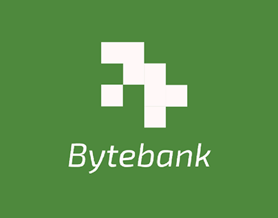

# 🏦 ByteBank - Aplicativo de Simulação Bancária

<div align="center">
  
  
  **Aplicativo de simulação bancária desenvolvido em Flutter**
  
  [](https://flutter.dev)
  [](https://firebase.google.com)
  [](LICENSE)
</div>

## 📋 Sobre o Projeto

ByteBank é uma aplicação mobile de simulação bancária desenvolvida como parte do **Tech Challenge da Fase 4** do curso de pós-graduação em **Front-End Engineering da FIAP**. 

O aplicativo permite aos usuários realizar operações bancárias simuladas como transferências, depósitos e saques, demonstrando habilidades em:
- Desenvolvimento Flutter
- Design responsivo e Material Design 3
- Gerenciamento de estado com Provider
- Integração com Firebase (Auth, Firestore, Storage)
- Boas práticas de arquitetura mobile

---

## ✨ Funcionalidades

### 🔐 Autenticação
- **Cadastro de usuários** com email e senha
- **Login** seguro via Firebase Authentication
- **Recuperação de senha** por e-mail
- **Logout** com confirmação

### 💰 Gestão Financeira
- **Dashboard** com saldo disponível, receitas e despesas
- **Histórico de transações** com filtros por tipo
- **Cadastro de transações** (receitas, despesas, transferências)
- **Upload de comprovantes** via Firebase Storage
- **Visualização detalhada** de cada transação
- **Busca** por descrição

### 🎨 Interface
- **Tema claro e escuro** alternável
- **Design responsivo** adaptado para diferentes telas
- **Animações fluidas** e transições suaves
- **Interface intuitiva** seguindo Material Design 3
- **Cores personalizadas** baseadas na identidade visual (verde)

---

## 🛠️ Stack Tecnológica

### Framework & Linguagem
- **Flutter**: ^3.10.8
- **Dart**: ^3.10.8

### Principais Dependências

#### Firebase
```yaml
firebase_core: ^3.13.0          # Núcleo do Firebase
firebase_auth: ^5.5.2           # Autenticação de usuários
cloud_firestore: ^5.6.5         # Banco de dados NoSQL
firebase_storage: ^12.4.4       # Armazenamento de arquivos
```

#### Gerenciamento de Estado
```yaml
provider: ^6.1.2                # State management
```

#### UI & Visualização
```yaml
fl_chart: ^0.70.2               # Gráficos e charts
intl: ^0.20.2                   # Internacionalização e formatação
animations: ^2.0.11             # Animações avançadas
```

#### Recursos de Imagem
```yaml
image_picker: ^1.1.2            # Seleção de imagens
cached_network_image: ^3.4.1   # Cache de imagens
```

#### Utilitários
```yaml
uuid: ^4.5.1                    # Geração de IDs únicos
path_provider: ^2.1.5           # Acesso a diretórios do sistema
shared_preferences: ^2.3.5      # Armazenamento local de preferências
```

#### Tipos Funcionais
```yaml
fpdart: ^1.1.0                  # Either/Failure no contrato do domínio
```

---

## 📁 Estrutura do Projeto

O projeto adota **Clean Architecture** com organização **feature-first**: cada
feature é um diretório autocontido subdividido em `domain/`, `data/` e
`presentation/`. O diretório `core/` agrega exclusivamente código transversal
sem regra de negócio.

```
lib/
├── main.dart                                  # Ponto de entrada da aplicação
├── app.dart                                   # Composition root + MaterialApp
├── firebase_options.dart                      # Configurações do Firebase
│
├── core/                                      # Código transversal sem regra de negócio
│   ├── di/
│   │   └── dependencies.dart                  # Composition root das features
│   ├── error/
│   │   ├── failure.dart                       # Hierarquia selada de Failure
│   │   └── exceptions.dart                    # Exceções da camada de dados
│   ├── network/
│   │   └── network_info.dart                  # Contrato de checagem de rede
│   ├── security/
│   │   └── secure_storage.dart                # Contrato de armazenamento seguro
│   ├── theme/
│   │   ├── app_theme.dart                     # ThemeData light/dark
│   │   └── app_colors.dart                    # Paleta de cores
│   ├── router/
│   │   └── app_router.dart                    # Nomes de rotas
│   ├── widgets/                               # Widgets reutilizáveis
│   │   ├── custom_button.dart
│   │   └── loading_indicator.dart
│   └── utils/
│       ├── constants.dart                     # Constantes da aplicação
│       ├── formatters.dart                    # Formatação de moeda/datas
│       └── validators.dart                    # Validadores de formulário
│
└── features/                                  # Features do produto
    ├── auth/
    │   ├── domain/
    │   │   ├── entities/
    │   │   │   └── app_user.dart              # Entidade de usuário (Dart puro)
    │   │   ├── repositories/
    │   │   │   └── auth_repository.dart       # Contrato (abstract class)
    │   │   └── usecases/
    │   │       ├── sign_in.dart
    │   │       ├── sign_up.dart
    │   │       ├── sign_out.dart
    │   │       ├── reset_password.dart
    │   │       ├── get_current_user.dart
    │   │       └── watch_auth_state.dart
    │   ├── data/
    │   │   ├── datasources/
    │   │   │   └── firebase_auth_data_source.dart
    │   │   ├── dtos/
    │   │   │   └── user_dto.dart              # fromMap/toMap, toEntity/fromEntity
    │   │   └── repositories/
    │   │       └── auth_repository_impl.dart  # Traduz Exception em Failure
    │   └── presentation/
    │       ├── controllers/
    │       │   └── auth_controller.dart       # Invoca casos de uso
    │       └── screens/
    │           ├── login_screen.dart
    │           └── register_screen.dart
    │
    ├── transactions/
    │   ├── domain/
    │   │   ├── entities/
    │   │   │   ├── transaction_entity.dart    # Renomeada para evitar
    │   │   │   │                              # colisão com cloud_firestore
    │   │   │   ├── transaction_type.dart
    │   │   │   └── transaction_category.dart
    │   │   ├── repositories/
    │   │   │   └── transaction_repository.dart
    │   │   └── usecases/
    │   │       ├── watch_transactions.dart    # Stream<List<TransactionEntity>>
    │   │       ├── create_transaction.dart
    │   │       ├── update_transaction.dart
    │   │       └── delete_transaction.dart
    │   ├── data/
    │   │   ├── datasources/
    │   │   │   ├── firestore_transaction_data_source.dart
    │   │   │   └── firebase_storage_data_source.dart
    │   │   ├── dtos/
    │   │   │   └── transaction_dto.dart
    │   │   └── repositories/
    │   │       └── transaction_repository_impl.dart
    │   └── presentation/
    │       ├── controllers/
    │       │   └── transaction_controller.dart
    │       ├── screens/
    │       │   ├── dashboard_screen.dart
    │       │   ├── transaction_list_screen.dart
    │       │   ├── transaction_form_screen.dart
    │       │   └── transaction_detail_screen.dart
    │       └── widgets/
    │           └── transaction_card.dart
    │
    └── profile/
        ├── domain/
        │   ├── entities/
        │   │   └── app_theme_mode.dart        # Enum de domínio para tema
        │   ├── repositories/
        │   │   └── theme_repository.dart
        │   └── usecases/
        │       ├── get_theme_mode.dart
        │       └── set_theme_mode.dart
        ├── data/
        │   ├── datasources/
        │   │   └── preferences_data_source.dart
        │   └── repositories/
        │       └── theme_repository_impl.dart
        └── presentation/
            ├── controllers/
            │   └── theme_controller.dart
            └── screens/
                └── profile_screen.dart
```

---

## 🚀 Como Executar o Projeto

### Pré-requisitos

Certifique-se de ter instalado:
- **Flutter SDK** (versão 3.10.8 ou superior)
- **Dart SDK** (versão 3.10.8 ou superior)
- **Android Studio** ou **Xcode** (para iOS)
- **Git**
- Conta no **Firebase Console**

### Passo 1: Clone o Repositório

```bash
git clone https://github.com/seu-usuario/bytebankApp.git
cd bytebankApp
```

### Passo 2: Configuração do Firebase

1. Acesse o [Firebase Console](https://console.firebase.google.com/)
2. Crie um novo projeto Firebase
3. Adicione um app Android e/ou iOS ao projeto
4. Baixe os arquivos de configuração:
   - **Android**: `google-services.json` → coloque em `android/app/`
   - **iOS**: `GoogleService-Info.plist` → coloque em `ios/Runner/`

5. **Configure o arquivo firebase_options.dart:**
   ```bash
   # Copie o arquivo de exemplo
   cp lib/firebase_options.dart.example lib/firebase_options.dart
   ```
   - Abra `lib/firebase_options.dart`
   - Substitua os valores de placeholder (`YOUR_*`) com as configurações reais do seu projeto Firebase
   - **IMPORTANTE**: NÃO faça commit deste arquivo! Ele já está no `.gitignore`

6. **Habilite os serviços no Firebase Console:**

   **Authentication:**
   - Acesse `Authentication` > `Sign-in method`
   - Habilite **Email/Password**

   **Cloud Firestore:**
   - Acesse `Firestore Database`
   - Crie um banco de dados
   - Configure as regras de segurança (use as de `firestore.rules`)

   **Storage:**
   - Acesse `Storage`
   - Ative o Firebase Storage
   - Configure as regras de segurança (use as de `storage.rules`)

### Passo 3: Instalar Dependências

```bash
flutter pub get
```

### Passo 4: Executar a Aplicação

#### Android
```bash
flutter run
```

#### iOS (somente em macOS)
```bash
cd ios
pod install
cd ..
flutter run
```

#### Build para Release

**Android APK:**
```bash
flutter build apk --release
```

**Android App Bundle:**
```bash
flutter build appbundle --release
```

**iOS:**
```bash
flutter build ios --release
```

---

## 🎨 Personalização do Ícone

O projeto usa `flutter_launcher_icons` para gerenciar os ícones da aplicação.

Para personalizar o ícone:

1. Coloque seu logo em `assets/images/logo.png` (recomendado: 1024x1024px)
2. Execute:
```bash
flutter pub run flutter_launcher_icons
```

---

## 🔥 Configuração do Firebase

### Regras do Firestore

```javascript
rules_version = '2';
service cloud.firestore {
  match /databases/{database}/documents {
    match /users/{userId} {
      allow read, create: if request.auth != null && request.auth.uid == userId;
      allow update, delete: if request.auth != null && request.auth.uid == userId;
    }

    match /transactions/{transactionId} {
      allow read, write: if request.auth != null
        && request.auth.uid == resource.data.userId;
      allow create: if request.auth != null
        && request.auth.uid == request.resource.data.userId;
    }
  }
}
```

### Regras do Storage

```javascript
rules_version = '2';
service firebase.storage {
  match /b/{bucket}/o {
    match /receipts/{userId}/{receiptId} {
      allow read, write: if request.auth != null && request.auth.uid == userId;
    }
  }
}
```

---

## 🏗️ Arquitetura

O projeto adota **Clean Architecture** em três camadas, organizadas por feature
(`auth`, `transactions`, `profile`). A regra de dependência aponta sempre para
o domínio: `Presentation → Domain ← Data`.

### 1. Domínio (`features/<x>/domain/`)

- **Entidades**: classes Dart puras, imutáveis, sem qualquer import de
  `package:flutter`, `package:firebase_*` ou `package:cloud_firestore`.
- **Repositórios (interfaces)**: contratos `abstract class` que descrevem
  operações de negócio em termos de entidades, retornando
  `Future<Either<Failure, T>>` ou `Stream<T>`.
- **Casos de Uso**: classes com método único `call(...)` encapsulando uma
  intenção do usuário (`SignIn`, `CreateTransaction`, `WatchTransactions`,
  etc.).

### 2. Dados (`features/<x>/data/`)

- **DTOs**: representam o formato remoto (Firestore). Possuem `fromMap`/
  `toMap` e `toEntity()`/`fromEntity()`, isolando o esquema remoto do
  domínio.
- **Data Sources**: classes que falam diretamente com Firebase
  (`firebase_auth`, `cloud_firestore`, `firebase_storage`) e
  `shared_preferences`. Não conhecem entidades.
- **Repositórios (implementações)**: traduzem `Exception` em `Failure`
  tipadas e orquestram fontes de dados.

### 3. Apresentação (`features/<x>/presentation/`)

- **Controllers**: invocam casos de uso e expõem estado observável via
  `ChangeNotifier`/`Provider`. Não conhecem Firebase nem repositórios
  diretamente.
- **Screens e Widgets**: consomem o estado dos controllers e renderizam
  a UI; nunca chamam casos de uso ou Firebase diretamente.

### Diagrama de Dependências

```
Presentation ──► Domain ◄── Data
   (Flutter)    (Dart puro)   (Firebase, shared_preferences)
```

Apresentação e Dados dependem do Domínio; o Domínio não depende de ninguém.

### Composition Root

`lib/core/di/dependencies.dart` concentra a montagem das árvores de objetos
das três features e expõe builders de controllers (`buildAuthController`,
`buildTransactionController`, `buildThemeController`) consumidos pelo
`MultiProvider` em `app.dart`.

---

## 📱 Fluxo da Aplicação

1. **Autenticação**
   - Usuário acessa a tela de login
   - Pode criar uma nova conta ou fazer login
   - Após login, é redirecionado ao Dashboard

2. **Dashboard**
   - Exibe resumo financeiro (saldo, receitas, despesas)
   - Lista últimas transações
   - Acesso rápido às funcionalidades

3. **Transações**
   - Visualizar todas as transações
   - Filtrar por tipo (receitas, despesas, transferências)
   - Adicionar nova transação com upload de comprovante
   - Ver detalhes e editar/excluir transações

4. **Perfil**
   - Visualizar informações do usuário
   - Alternar tema claro/escuro
   - Fazer logout

---

## 🧪 Testes

Para executar os testes:

```bash
flutter test
```

---

## 🤝 Contribuindo

Contribuições são bem-vindas! Sinta-se à vontade para:

1. Fazer fork do projeto
2. Criar uma branch para sua feature (`git checkout -b feature/MinhaFeature`)
3. Commit suas mudanças (`git commit -m 'Adiciona MinhaFeature'`)
4. Push para a branch (`git push origin feature/MinhaFeature`)
5. Abrir um Pull Request

---

## 👥 Autores

**Grupo 30 - FIAP Fase 4**

- Desenvolvido como Tech Challenge da Pós-Graduação Front-End Engineering

- Vitor Oliveira | RM368082
- Douglas Matos Gomes | RM366779

---

## 📄 Licença

Este projeto está sob a licença MIT. Consulte o arquivo [LICENSE](LICENSE) para mais detalhes.

---